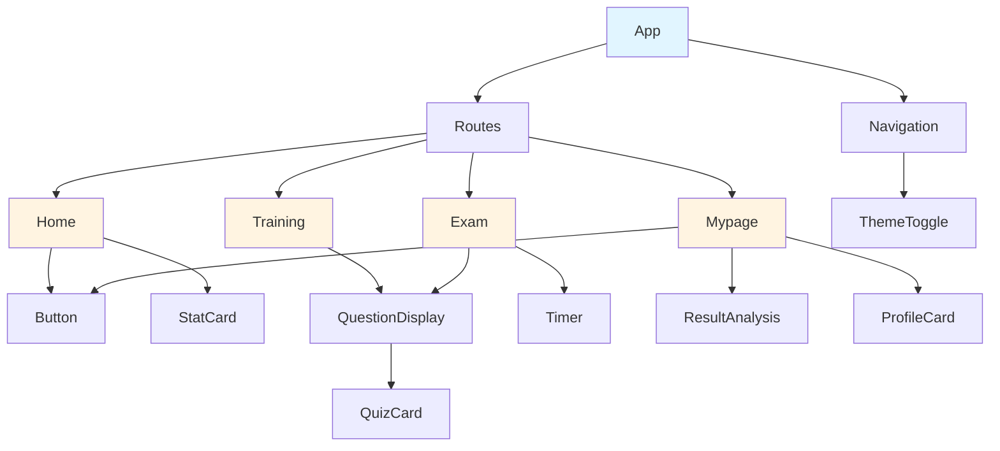
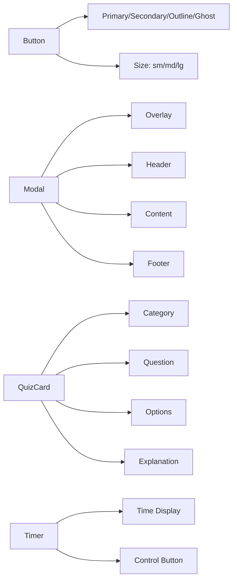

# 컴포넌트 계층 구조

## 전체 컴포넌트 트리

## 공통 컴포넌트

## 페이지별 컴포넌트 구성

### Home 페이지
- Hero Section
- StatCard (3개)
- Button (2개)
- ActivityList

### Training 페이지
- Header (제목, 진행률)
- QuestionDisplay
  - QuizCard
- Footer (다음 문제 버튼)

### Exam 페이지
- Header (제목, Timer)
- ProgressBar
- QuestionDisplay
  - QuizCard
- Footer (제출 버튼)

### Mypage 페이지
- ProfileCard
- StatCard (4개)
- ResultAnalysis
- SettingsList
