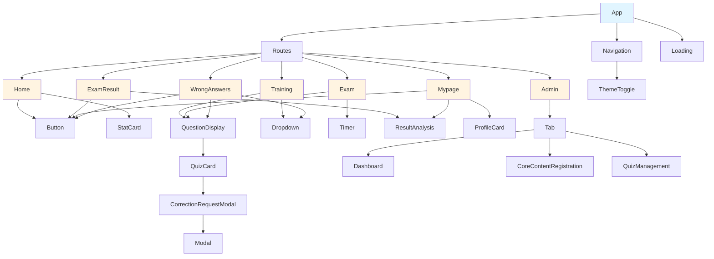
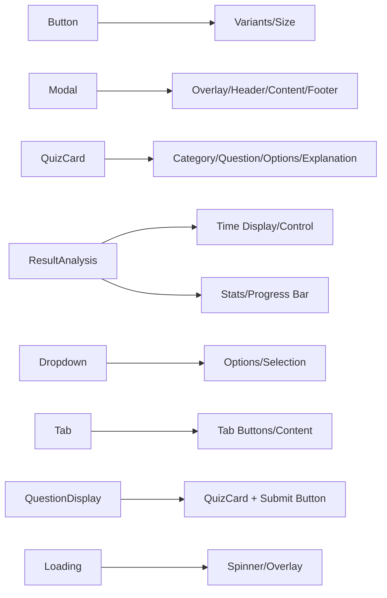

# 컴포넌트 계층 구조

## 전체 컴포넌트 트리

```mermaid
graph TD
    A[App] --> B[Navigation]
    A --> C[Routes]
    A --> P[Loading]
    C --> D[Home]
    C --> E[Training]
    C --> F[Exam]
    C --> Q[ExamResult]
    C --> G[Mypage]
    C --> R[WrongAnswers]
    C --> S[Admin]
    
    B --> H[ThemeToggle]
    
    D --> I[Button]
    D --> J[StatCard]
    
    E --> K[QuestionDisplay]
    E --> T[Dropdown]
    K --> L[QuizCard]
    L --> U[CorrectionRequestModal]
    U --> V[Modal]
    
    F --> M[Timer]
    F --> K
    
    Q --> N[ResultAnalysis]
    Q --> I
    
    G --> N
    G --> I
    G --> O[ProfileCard]
    
    R --> K
    R --> T
    R --> I
    
    S --> W[Tab]
    W --> X[Dashboard]
    W --> Y[CoreContentRegistration]
    W --> Z[QuizManagement]
    
    style A fill:#e1f5ff
    style D fill:#fff4e1
    style E fill:#fff4e1
    style F fill:#fff4e1
    style Q fill:#fff4e1
    style G fill:#fff4e1
    style R fill:#fff4e1
    style S fill:#fff4e1
```

## 공통 컴포넌트

```mermaid
graph LR
    A[Button] --> B[Variants/Size]
    D[Modal] --> E[Overlay/Header/Content/Footer]
    I[QuizCard] --> J[Category/Question/Options/Explanation]
    N[Timer] --> O[Time Display/Control]
    T[Dropdown] --> AA[Options/Selection]
    W[Tab] --> AB[Tab Buttons/Content]
    K[QuestionDisplay] --> L[QuizCard + Submit Button]
    N[ResultAnalysis] --> AC[Stats/Progress Bar]
    P[Loading] --> AD[Spinner/Overlay]
```