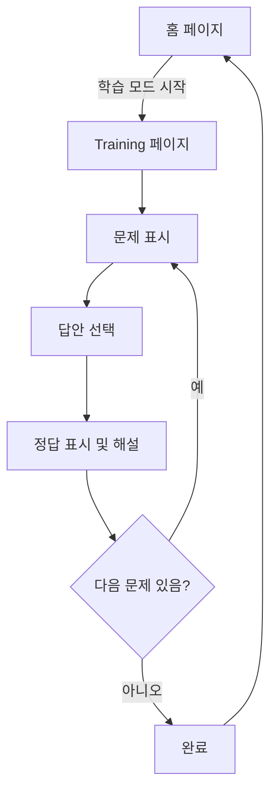
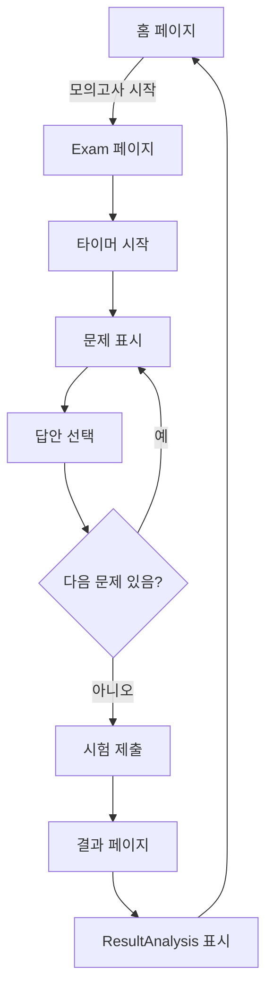
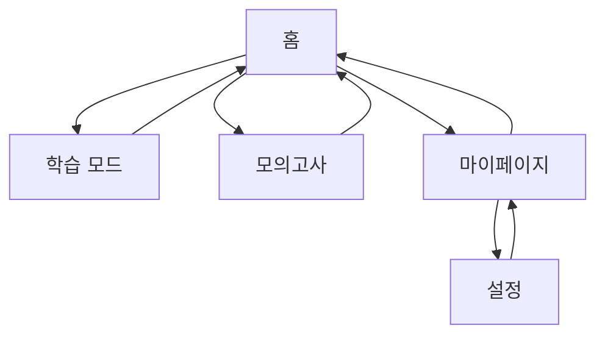

# 사용자 플로우

## 학습 모드 플로우

```mermaid
flowchart TD
    A[홈 페이지] -->|학습 모드 시작| B[Training 페이지]
    B --> C[문제 표시]
    C --> D[답안 선택]
    D --> E[정답 표시 및 해설]
    E --> F{다음 문제 있음?}
    F -->|예| C
    F -->|아니오| G[완료]
    G --> A
```

## 모의고사 플로우

```mermaid
flowchart TD
    A[홈 페이지] -->|모의고사 시작| B[Exam 페이지]
    B --> C[타이머 시작]
    C --> D[문제 표시]
    D --> E[답안 선택]
    E --> F{다음 문제 있음?}
    F -->|예| D
    F -->|아니오| G[시험 제출]
    G --> H[결과 페이지]
    H --> I[ResultAnalysis 표시]
    I --> A
```

## 전체 네비게이션 플로우

```mermaid
flowchart TD
    A[홈] --> B[학습 모드]
    A --> C[모의고사]
    A --> D[마이페이지]
    B --> A
    C --> A
    D --> A
    D --> E[설정]
    E --> D
```
