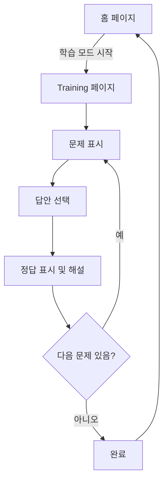
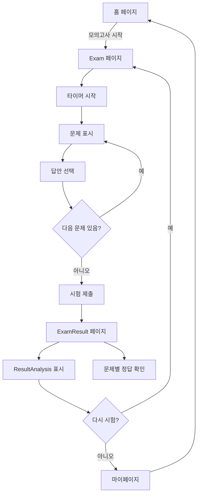
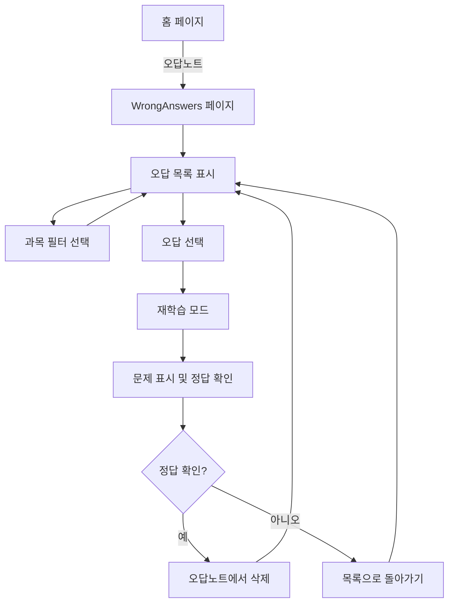
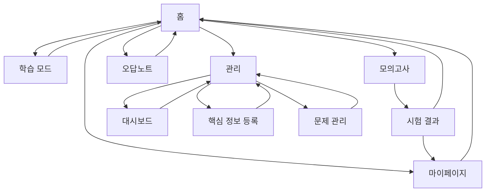

# 사용자 플로우

## 학습 모드 플로우

```mermaid
flowchart TD
    A[홈 페이지] -->|학습 모드 시작| B[Training 페이지]
    B --> C[문제 표시]
    C --> D[답안 선택]
    D --> E[정답 표시 및 해설]
    E --> F{다음 문제 있음?}
    F -->|예| C
    F -->|아니오| G[완료]
    G --> A
```

## 모의고사 플로우

```mermaid
flowchart TD
    A[홈 페이지] -->|모의고사 시작| B[Exam 페이지]
    B --> C[타이머 시작]
    C --> D[문제 표시]
    D --> E[답안 선택]
    E --> F{다음 문제 있음?}
    F -->|예| D
    F -->|아니오| G[시험 제출]
    G --> H[ExamResult 페이지]
    H --> I[ResultAnalysis 표시]
    H --> J[문제별 정답 확인]
    I --> K{다시 시험?}
    K -->|예| B
    K -->|아니오| L[마이페이지]
    L --> A
```

## 오답노트 플로우

```mermaid
flowchart TD
    A[홈 페이지] -->|오답노트| B[WrongAnswers 페이지]
    B --> C[오답 목록 표시]
    C --> D[과목 필터 선택]
    D --> C
    C --> E[오답 선택]
    E --> F[재학습 모드]
    F --> G[문제 표시 및 정답 확인]
    G --> H{정답 확인?}
    H -->|예| I[오답노트에서 삭제]
    H -->|아니오| J[목록으로 돌아가기]
    I --> C
    J --> C
```

## 전체 네비게이션 플로우

```mermaid
flowchart TD
    A[홈] --> B[학습 모드]
    A --> C[모의고사]
    A --> D[마이페이지]
    A --> E[오답노트]
    A --> F[관리]
    B --> A
    C --> G[시험 결과]
    G --> A
    G --> D
    D --> A
    E --> A
    F --> H[대시보드]
    F --> I[핵심 정보 등록]
    F --> J[문제 관리]
    H --> F
    I --> F
    J --> F
```
